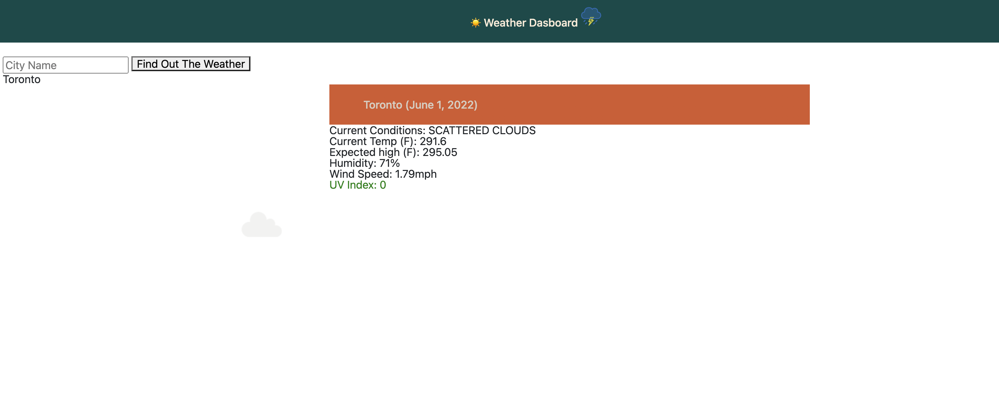
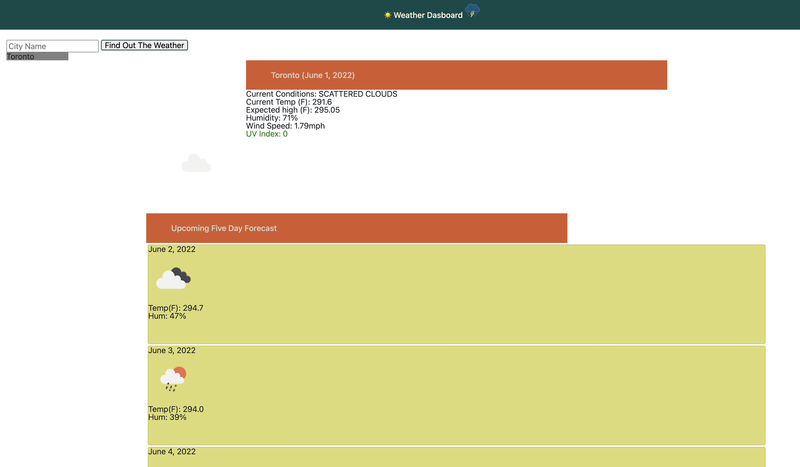

# WeatherTracker

The deployed application shows the weather conditions for the city inputted into the search as well as the future 5 day forcast. Each list of weather conditions includes the temperature, the favor of condition, the humidity, windspeed, and uv index which is also color coded. The code accesses the open weather api and stores searches into local storage accordingly.

Deployment link:

https://linklg1.github.io/WeatherTracker/

Screenshots:

